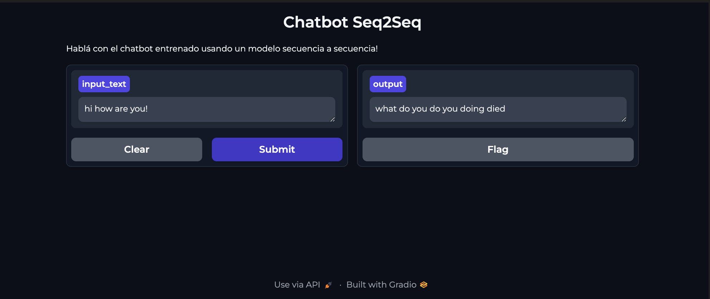
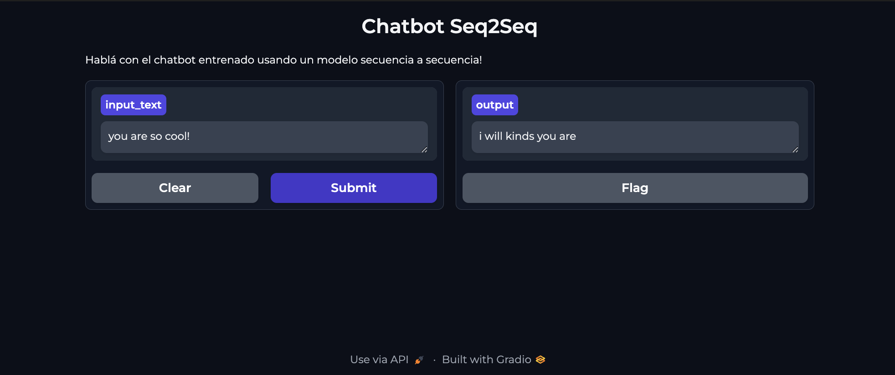
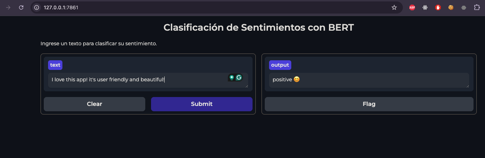
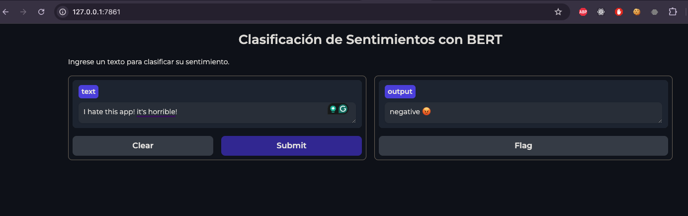
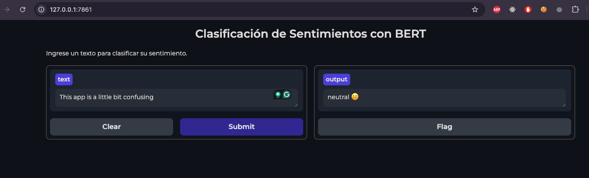

# NLP Projects

## Project 1 - Vectorization & Naïve Bayes Classificantion 
Se realizó una vectorización de documentos como también la realización de entrenamientos de distintos modelos de Bayes. La consigna principal era realizar un primer acercamiento a lo que son los embeddings a través de la transposición de la matríz documento-término.

### Dataset: 
`fetch_20newsgroups` de `sklearn`

### Colab
[Vectorization - Naive Bayes](https://colab.research.google.com/drive/1G2OT0OlJ7hcDNuO1HTaxpVejN6V0NPsB?usp=sharing)

## Project 2 - Custom Embeddings & Gensim - Word2Vec
Se utilizaron embeddings con word2Vec, con diferentes técnicas como Skip-Gram y CBOW. Se utilizó un corpus de texto literario: [Orgullo y Prejuicio - Jane Austen](https://www.textos.info/jane-austen/orgullo-y-prejuicio)
y se emplearon técnicas de reducción de dimensionalidad provistas en clase como PCA y T-SNE, para tipos de modelos de lenguaje grande (LLM) como el que se utilizó.

### Colab
[Custom Embeddings con Gensim](https://colab.research.google.com/drive/16zILcrn9sXVkJqFuoVHLTsjq8GQPsdYB?usp=sharing)

## Project 3 - Tokenization by word & char
Se probaron distintas estrategias para conseguir el mejor modelo de lenguaje. Estrategias utilizadas: Greedy y Beam, con diferentes unidades recurrentes (SimpleRNN, LSTM, GRU).

El corpus de texto utilizado: [Orgullo y Prejuicio - Jane Austen](https://www.textos.info/jane-austen/orgullo-y-prejuicio)

### Colab links
1. [Tokenización por palabra](https://colab.research.google.com/drive/1LkWok653p_4QlKI_Vp4QyFv6_X_8fDnz?usp=sharing)
2. [Tokenización por caracter](https://colab.research.google.com/drive/1v4nmvaJFaCdGGgVL-VmF37ALu9KC36-F?usp=sharing)

## Project 4 - QA Chatbot LSTM & GloVe embeddings
Se utilizó una arquitectura encoder-decoder con unidades recurrentes LSTM. 
Dataset: `data_volunteers.json` disponible en la carpeta.

Dataset: [data_volunteers.json](https://drive.google.com/uc?id=1awUxYwImF84MIT5-jCaYAPe2QwSgS1hN&export=download)

### Requisitos 
`python ^3.10`

### Colab 
[Chatbot QA](https://colab.research.google.com/drive/1fQyH7ht-W690_l334LhMmsBMkTr_OMrV?usp=sharing)

## Project 5 - Sentiment Analysis using Transfer Learning & BERT
   
Se utilizó el modelo BERT base, y se realizó transfer learning. 
Se realizaron distintas estrategias como:
- No descongelamiento de capas para modelos con 3 y 5 clases de salida.
- Fine Tuning descongelando todas las capas, con 3 clases de salida.
- En el caso de las 3 clases, se aplico un balanceo de la variable `score` como `sentiment`, las cuales tendrán de salida `[negative, neutral, positive]`

### Datasets: 
1. [apps.csv](https://drive.google.com/u/0/uc?id=1S6qMioqPJjyBLpLVz4gmRTnJHnjitnuV&export=download&confirm=t)
2. [reviews.csv](https://drive.google.com/u/0/uc?id=1zdmewp7ayS4js4VtrJEHzAheSW-5NBZv&export=download&confirm=t)

### Requisitos:
`python ^3.10`

### Colab links
1. [model_3_classes_fine_tuning](https://colab.research.google.com/drive/1p07TFdqyEyjyshoqsSgQuSbr_y7ARg2j?usp=sharing)
2. [model_3_classes_no_fine_tuning](https://colab.research.google.com/drive/1e0PGS5iT7GM-ckSFCJ05hs4lcL8K_lVu?usp=sharing)
3. [model_5_classes_no_fine_tuning](https://colab.research.google.com/drive/1IxbN5n8TRUdF5EkSMmh7KUjn8J-LzJ3g?usp=sharing)

El modelo elegido para este ejemplo es al que se le realizo fine tuning ya que es el que mejor accuracy y precisión tuvo: 

